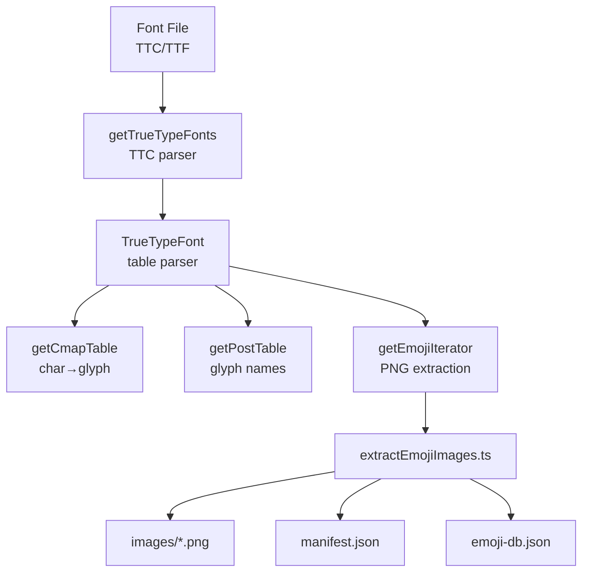

# emoji-db

Extracts emoji PNGs and metadata from Apple's Color Emoji font and generates a searchable JSON database.

## Quick Start

```bash
yarn install
yarn start  # Extract images + generate DB (requires font in fonts/)
```

## Scripts

| Command | Description |
|---------|-------------|
| `yarn start` | Extract images + generate emoji-db.json |
| `yarn ci` | Full pipeline: fetch data, convert, extract, generate |
| `yarn copy-latest` | Copy system emoji font to `fonts/` |
| `yarn extract-images` | Extract PNGs from font |
| `yarn generate-db` | Generate emoji-db.json |
| `yarn fetch-data` | Download CLDR/Unicode data files |
| `yarn convert` | Convert downloaded data to JSON |
| `yarn typecheck` | Run TypeScript type checking |

## Architecture



## Output

```
images/
├── *.png              # Main emoji images (~3,465)
├── components/        # Composition building blocks (~126)
│   └── *.png          # Silhouettes, L/R/RA variants for multi-skin-tone emoji
└── manifest.json      # Glyph name → file path mapping

emoji-db.json          # Searchable emoji database with keywords, codepoints, etc.
```

## Glyph Name Format

Apple's internal glyph names follow this pattern:

```
u1F468_u1F9AF.3.M.u27A1.L
│      │      │ │  │    └─ Component suffix (L/R/RA)
│      │      │ │  └────── Direction codepoint
│      │      │ └───────── Gender modifier (M/W/B/G)
│      │      └─────────── Fitzpatrick skin tone (1-5, or 11-55 for pairs)
│      └────────────────── Additional codepoints (ZWJ sequences)
└───────────────────────── Base codepoint(s)
```

## Font Tables

The extractor parses these OpenType/TrueType tables:

| Table | Purpose |
|-------|---------|
| **sbix** | Apple's bitmap emoji table (PNG data) |
| **cmap** | Character to glyph mapping (format 12) |
| **post** | PostScript glyph names (v2.0.0) |
| **head/maxp/name** | Font metadata |

### sbix Graphic Types

| Type | Description |
|------|-------------|
| `png ` | PNG bitmap data |
| `flip` | Horizontal mirror reference (directional emoji) |
| `dupe` | Duplicate reference (shared images) |
| `emjc` | LZFSE compressed (not supported) |

## Data Sources

- [CLDR annotations](https://github.com/unicode-org/cldr) - Keywords and descriptions
- [Unicode emoji sequences](https://unicode.org/Public/emoji/latest/) - ZWJ, variation, flags
- Apple Color Emoji font - System font or copied to `fonts/`

## Dependencies

- **[sharp](https://sharp.pixelplumbing.com/)** - Image processing for flip transformations
- **ts-node** - TypeScript execution
- **yaml** - Extra keywords parsing

## Resources

### Unicode Data

- [All emoji (sans joined variants)](http://unicode.org/cldr/utility/list-unicodeset.jsp?a=%5B%3Aemoji%3A%5D&g=emoji)
- [Full emoji list with images](http://unicode.org/emoji/charts/full-emoji-list.html) (30+ MB)
- [Unicode emoji data (latest)](https://unicode.org/Public/emoji/latest/)
- [Unicode TRAC browser](http://www.unicode.org/utility/trac/browser/trunk?order=name#unicodetools/data/emoji/)

### Font Specifications

- [OpenType spec](https://docs.microsoft.com/en-us/typography/opentype/spec/otff)
- [Apple TrueType Reference](https://developer.apple.com/fonts/TrueType-Reference-Manual/)

### Related Projects

- [foliojs/restructure](https://github.com/foliojs/restructure) - Binary data parsing
- [luafontkit TrueTypeCollection.js](https://github.com/deepakjois/luafontkit/blob/4832aa04f501ed1b7a3d2691022deaafac3c0d27/src/TrueTypeCollection.js)

### macOS

- [macOS build numbers](https://support.apple.com/en-us/HT201260)

## Converting Codepoints to Emoji

The unicode codepoint for :sunglasses: is `1f60e`.

```js
String.fromCodePoint(parseInt('1f60e', 16));  // 😎
```
